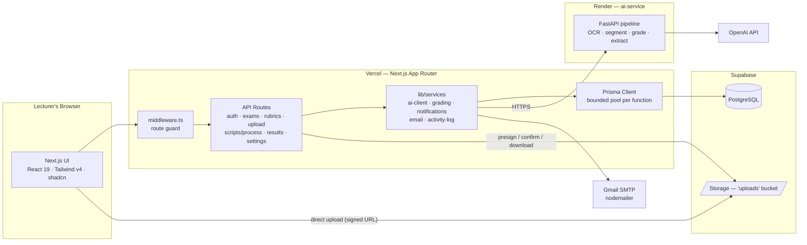
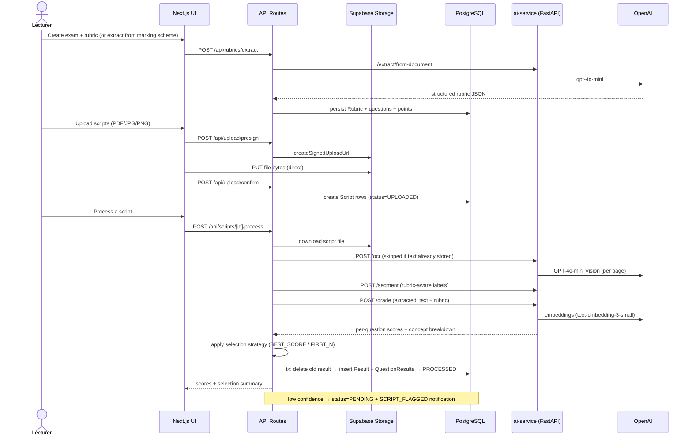
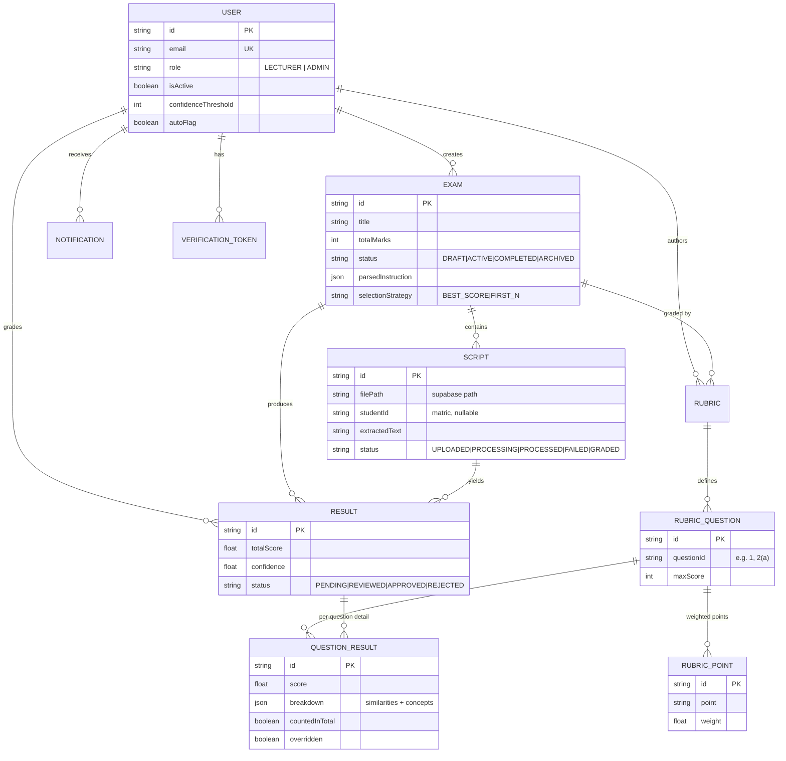

# TheoGrader

An intelligent assessment system for **automated grading of handwritten theoretical examination scripts** in Nigerian universities.

Lecturers upload scanned exam scripts plus a marking scheme. TheoGrader extracts the rubric structure, transcribes the handwriting with vision OCR, segments answers per question, scores each answer semantically against the rubric, and flags low-confidence results for human review — with full score-override support.

> Final-year project: *"Design and Development of an Intelligent Assessment System for Automated Grading of Theoretical Examination Scripts in Nigerian Universities."*

**Companion service:** [Theo-ai-service](https://github.com/mayormankind/Theo-ai-service) — the FastAPI AI pipeline this app calls (hosted on Render).

## Features

- **Auth** — email/password or OTP login, email verification, password reset; sealed-cookie sessions via `iron-session` (7-day rolling, httpOnly)
- **Exams** — CRUD with lifecycle `DRAFT → ACTIVE → COMPLETED → ARCHIVED`, plus exam instructions like *"answer any 3 of 5"* parsed into selection rules
- **Rubrics** — AI-assisted extraction from marking schemes (PDF/image/pasted text), manual editing, templates, duplication
- **Uploads** — presigned **direct-to-Supabase** uploads (PDF/JPG/PNG ≤ 20 MB each); files never transit the Vercel function
- **Grading** — per-script pipeline (OCR → segment → score), answer-selection strategies, confidence thresholding with auto-flag for review
- **Review** — per-question breakdown showing matched/partial/missing rubric concepts, score overrides, approve/reject workflow
- **Reporting** — PDF export (`jspdf` + autotable), dashboard stats, activity log, in-app notifications

## Architecture



**Why this shape:** the web app owns persistence, auth, and orchestration; the Python service owns the AI work. Large files go straight to Supabase Storage via signed URLs so serverless functions stay under body-size limits. Prisma's connection pool is capped per function (`lib/prisma.ts`) so concurrent serverless instances can't exhaust the database pooler.

## End-to-End Grading Flow



## Grading Semantics

- **Every rubric question gets a result.** If the student didn't answer it (or segmentation can't find it), it records an explicit `0` — never a missing row.
- **Answer selection.** When an exam says *"answer any 3 of 5"*, `lib/utils/answer-selector.ts` picks which answers count: `BEST_SCORE` (highest-scoring N) or `FIRST_N` (first N in document order). Excluded questions keep their row with `countedInTotal=false` and a reason.
- **Confidence flagging.** The average per-question similarity is compared to the lecturer's `confidenceThreshold` setting; below it, the result stays `PENDING` and a `SCRIPT_FLAGGED` notification is created. Otherwise the result is `APPROVED`.
- **Idempotent re-grading.** Each script has exactly one current `Result` — re-grading deletes the old result inside the same transaction instead of appending duplicates.
- **Transient failures don't fabricate zeros.** A 503 from the AI service (embedding provider down) aborts before any write; the script returns to `UPLOADED` and stays retryable.
- **OCR reuse.** Re-grading reuses stored `extractedText` unless it's empty or flagged `low_quality_fallback_used` — OCR is non-deterministic, and re-running it caused score drift.
- **Matric fallback.** Identity normalisation (`normalizeMatric` in the process route) fixes common OCR errors (I/1, S/5, missing slashes); when it can't parse, it keeps the raw text so the lecturer has something editable rather than a blank field.

## Data Model



Also: `Notification` (grading events), `ActivityLog` (audit trail), `Setting` (key/value config), `BatchJobMeta` (in-flight batch metadata shared across serverless instances), `VerificationToken` (email verify). Full schema in [`prisma/schema.prisma`](prisma/schema.prisma).

## Tech Stack

| Layer | Choice |
|---|---|
| Framework | Next.js 15 (App Router), React 19, TypeScript |
| Styling | Tailwind CSS v4, shadcn/Radix UI, tw-animate-css |
| Auth | iron-session sealed cookies, bcryptjs, crypto tokens |
| DB / ORM | PostgreSQL (Supabase), Prisma 6 |
| Storage | Supabase Storage (`uploads` bucket, signed URLs) |
| Email | nodemailer → Gmail SMTP |
| Validation | zod, react-hook-form + @hookform/resolvers |
| Charts/PDF | recharts, jspdf + jspdf-autotable |
| AI backend | [Theo-ai-service](https://github.com/mayormankind/Theo-ai-service) via `lib/services/ai-client.ts` (60–180s timeouts, 3 retries, exponential backoff) |

## Getting Started

### Prerequisites

- Node.js 20+ and pnpm
- A Supabase project (Postgres + a public `uploads` storage bucket)
- The AI service running (locally or on Render)

### Environment variables

Create `.env`:

```env
# Database (Supabase Postgres — use the pooler URL for DATABASE_URL)
DATABASE_URL="postgresql://..."
DIRECT_URL="postgresql://..."

# Supabase
NEXT_PUBLIC_SUPABASE_URL="https://<project>.supabase.co"
NEXT_PUBLIC_SUPABASE_ANON_KEY="..."
SUPABASE_SERVICE_ROLE_KEY="..."          # server-side only

# AI service
AI_SERVICE_URL="http://localhost:8000"   # or https://<service>.onrender.com
NEXT_PUBLIC_AI_SERVICE_URL="..."         # same, for client hints

# Sessions — random 32+ char string
SESSION_PASSWORD="..."

# Email (Gmail app password)
SMTP_USER="you@gmail.com"
SMTP_PASS="app-password"
SMTP_FROM='"TheoGrader" <you@gmail.com>'
NEXT_PUBLIC_APP_URL="http://localhost:3000"
```

### Install & run

```bash
pnpm install          # postinstall runs `prisma generate`
pnpm db:push          # sync schema to your database
pnpm dev              # http://localhost:3000
```

Useful scripts: `pnpm lint`, `pnpm db:studio`, `pnpm db:migrate`, `pnpm db:seed`.

## API Surface

| Group | Routes |
|---|---|
| Auth | `POST /api/auth/signup` · `POST|PUT /api/auth/login` (password & OTP) · `POST /api/auth/logout` · `GET /api/auth/me` · `GET|POST /api/auth/verify` · `POST|PUT /api/auth/forgot-password` |
| Exams | `GET|POST /api/exams` · `GET|PATCH|DELETE /api/exams/[id]` · `GET /api/exams/[id]/rubric` · `GET /api/exams/[id]/scripts` |
| Rubrics | `GET|POST /api/rubrics` · `GET|PATCH|DELETE /api/rubrics/[id]` · `POST /api/rubrics/[id]/duplicate` · `POST /api/rubrics/extract` (AI) |
| Upload | `POST /api/upload` (server-proxied) · `POST /api/upload/presign` · `POST /api/upload/confirm` · `GET /api/upload/[scriptId]` (signed file URL) |
| Processing | `POST /api/scripts/[scriptId]/process` (OCR→segment→grade→persist) · `GET|DELETE /api/scripts/[scriptId]` |
| Grading | `POST /api/grading` (batch orchestration) · `GET|PATCH /api/grading/result/[id]` (review/override) |
| Results | `GET /api/results` · `GET|PATCH|DELETE /api/results/[id]` |
| Notifications | `GET /api/notifications` · `PATCH /api/notifications/[id]` · `POST /api/notifications/grading-complete` |
| Settings | `GET|PATCH /api/settings` · `profile` · `password` · `avatar` · `ai-service` (health probe) |
| Dashboard | `GET /api/dashboard/stats` |

All mutating routes are session-guarded via `requireAuth`/`requireAuthWithFreshRole` (`lib/session.ts`) and scoped to the authenticated user.

## Project Layout

```
TheoGrader/
├── app/
│   ├── api/                  # route handlers (table above)
│   ├── auth/                 # login / signup / verify / reset pages
│   ├── dashboard/            # exams, rubrics, upload, grading, results, settings
│   ├── layout.tsx, page.tsx, globals.css
│   └── types/, utils/
├── components/               # auth, dashboard, landing, providers, ui (shadcn)
├── lib/
│   ├── ai/                   # rubric-extraction client helpers
│   ├── api/                  # client-side API wrappers
│   ├── services/             # ai-client, grading, email, notifications, activity-log
│   ├── utils/                # answer-selector, instruction-parser, question-label
│   ├── prisma.ts             # bounded-pool Prisma singleton
│   ├── session.ts            # iron-session helpers + requireAuth
│   ├── supabase.ts           # storage client (lazy, service-role)
│   └── pdf-report.ts         # PDF export
├── prisma/schema.prisma
├── middleware.ts             # route guard
└── .github/workflows/        # keep-supabase-alive (Mon & Thu ping)
```

## Deployment

- **App:** Vercel (Next.js). Set all env vars above; `pnpm build` runs `prisma generate && next build`.
- **AI service:** Render — see the [companion repo](https://github.com/mayormankind/Theo-ai-service).
- **Supabase keep-alive:** `.github/workflows/keep-supabase-alive.yml` pings the project twice a week so the free-tier database doesn't auto-pause after 7 idle days.

## Documentation

- [`System_ARCHITECTURE.md`](System_ARCHITECTURE.md) — deep dive: auth flows, schema, security model, error handling.
- AI pipeline internals — [Theo-ai-service README](https://github.com/mayormankind/Theo-ai-service).
